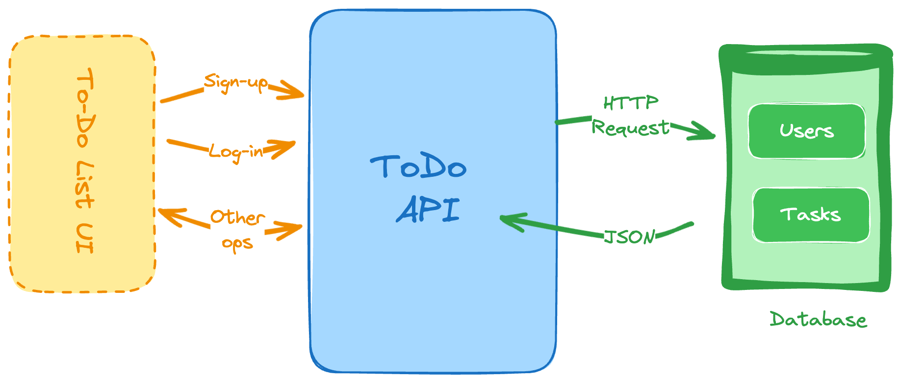

# Todo List API
In this project you are required to develop a RESTful API to allow users to manage their to-do list. The previous backend projects have only focused on the CRUD operations, but this project will require you to implement user authentication as well.



## Goals
The skills you will learn from this project include:

- User authentication
- Schema design and Databases
- RESTful API design
- CRUD operations
- Error handling
- Security
- Implement filtering and sorting for the to-do list **(Bonus)**
- Implement unit tests for the API **(Bonus)**
- Implement rate limiting and throttling for the API **(Bonus)**
- Implement refresh token mechanism for the authentication **(Bonus)**

## Requirements
You are required to develop a RESTful API with following endpoints

1. User registration to create a new user
2. Login endpoint to authenticate the user and generate a token
3. CRUD operations for managing the to-do list
4. Implement user authentication to allow only authorized users to access the to-do list
5. Implement error handling and security measures
6. Use a database to store the user and to-do list data (you can use any database of your choice)
7. Implement proper data validation
8. Implement pagination and filtering for the to-do list

### User Registration
```json
Endpoint: POST /register

Request Body:
{
  "name": "John Doe",
  "email": "john@doe.com",
  "password": "password"
}

Responses (200 - Success):
{
  "token": "eyJhbGciOiJIUzI1NiIsInR5cCI6IkpXVCJ9"
}
```

### User Login
```json
Endpoint: POST /login

Request Body:
{
  "email": "john@doe.com",
  "password": "password"
}

Responses (200 - Success):
{
  "token": "eyJhbGciOiJIUzI1NiIsInR5cCI6IkpXVCJ9"
}
```

### Create a To-Do Item
```json
Endpoint: POST /todos

Request Body:
{
  "title": "Buy groceries",
  "description": "Buy milk, eggs, and bread"
}

Responses (200 - Success):
{
  "id": 1,
  "title": "Buy groceries",
  "description": "Buy milk, eggs, and bread"
}
Responses (401 - Failed):
{
  "message": "Unauthorized"
}
```

### Update a To-Do Item
```json
Endpoint: PUT /todos/1

Request Body:
{
  "title": "Buy groceries",
  "description": "Buy milk, eggs, bread, and cheese"
}

Responses (200 - Success):
{
  "id": 1,
  "title": "Buy groceries",
  "description": "Buy milk, eggs, bread, and cheese"
}
Responses (403 - Failed):
{
  "message": "Forbidden"
}
```

### Delete a To-Do Item
```json
Request :
DELETE /todos/1

Responses (204 - Success):
{}
```

### Get To-Do Items
```json
Endpoint: GET /todos?page=1&limit=10

Responses (200 - Success):
{
  "data": [
    {
      "id": 1,
      "title": "Buy groceries",
      "description": "Buy milk, eggs, bread"
    },
    {
      "id": 2,
      "title": "Pay bills",
      "description": "Pay electricity and water bills"
    }
  ],
  "page": 1,
  "limit": 10,
  "total": 2
}
```

Enjoy Coding! 😉